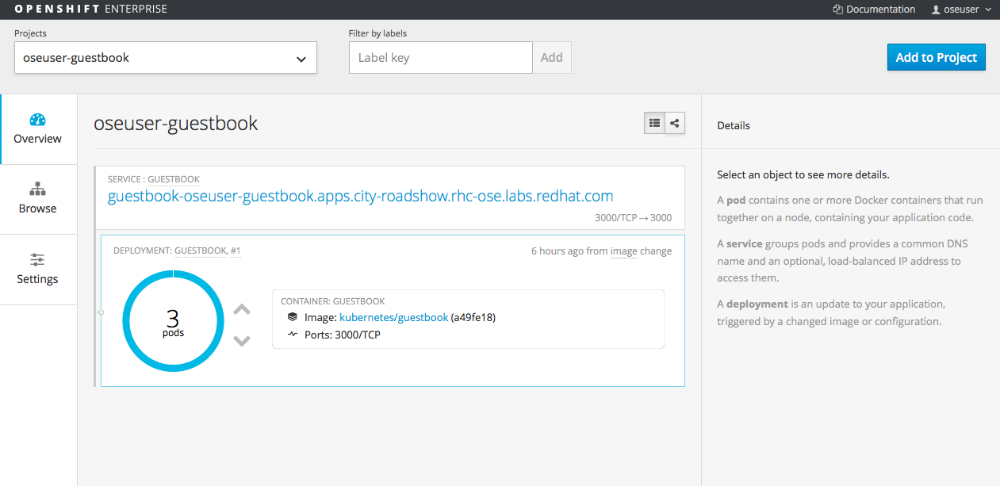

#**Lab 4: Scaling and Self Healing**

###**Background: Deployment Configurations and Replication Controllers**

While Services provide routing and load balancing for Pods, which may go in and
out of existence, ReplicationControllers (RC) are used to specify and then
ensure the desired number of Pods (replicas) are in existence. For example, if
you always want your application server to be scaled to 3 Pods, a
ReplicationController is needed. Without an RC, any Pods that are killed or
somehow die are not automatically restarted, either. Replication Controllers are
how OpenShift "self heals".

A DeploymentConfiguration (DC) defines how something in OpenShift should be
deployed. From the [deployments
documentation](https://docs.openshift.com/enterprise/3.1/architecture/core_concepts/deployments.html#deployments-and-deployment-configurations):

    Building on replication controllers, OpenShift adds expanded support for the
    software development and deployment lifecycle with the concept of deployments.
    In the simplest case, a deployment just creates a new replication controller and
    lets it start up pods. However, OpenShift deployments also provide the ability
    to transition from an existing deployment of an image to a new one and also
    define hooks to be run before or after creating the replication controller.

In almost all cases, you will end up using the Pod, Service,
ReplicationController and DeploymentConfiguration resources together. And, in
almost all of those cases, OpenShift will create all of them for you.

###**Exercise 3: Scaling up**
Now that we know what a ReplicatonController and DeploymentConfig are, we can
start to explore scaling in OpenShift 3. Take a look at the
ReplicationController (RC) that was created for you when you told OpenShift to
stand up the *guestbook* image:

    $ oc get rc

    CONTROLLER    CONTAINER(S)   IMAGE(S)                                                                                       SELECTOR                                                          REPLICAS   AGE
    guestbook-1   guestbook      kubernetes/guestbook@sha256:a49fe18bb57c8eee16e2002987e041f5ae9b5b70ae7b3d49eb60e5c26b9c6bd0   app=guestbook,deployment=guestbook-1,deploymentconfig=guestbook   1          5h

Again, to get more details (once you know the name of RC), you can use the
following command:

    $ oc get rc guestbook-1 -o json

For example, if you just want to see how many replicas are defined for the
*guestbook* image, you can enter in the following command:

    $ oc get rc guestbook-1 -o json | grep -B1 -E "replicas" | grep -v Docker

**Note:** The above command uses the *grep* utility which may not be available on your operating system.  

The output of the above command should be:

               "openshift.io/deployment.phase": "Complete",
            "openshift.io/deployment.replicas": "1",
            "openshift.io/encoded-deployment-config": "{\"kind\":\"DeploymentConfig\",\"apiVersion\":\"v1\",\"metadata\":{\"name\":\"guestbook\",\"namespace\":\"oseuser-guestbook\",\"selfLink\":\"/oapi/v1/namespaces/oseuser-guestbook/deploymentconfigs/guestbook\",\"uid\":\"fa5fffa6-d821-11e5-ae80-fa163e7c0b25\",\"resourceVersion\":\"21687\",\"creationTimestamp\":\"2016-02-20T22:33:35Z\",\"labels\":{\"app\":\"guestbook\"},\"annotations\":{\"openshift.io/generated-by\":\"OpenShiftNewApp\"}},\"spec\":{\"strategy\":{\"type\":\"Rolling\",\"rollingParams\":{\"updatePeriodSeconds\":1,\"intervalSeconds\":1,\"timeoutSeconds\":600,\"maxUnavailable\":\"25%\",\"maxSurge\":\"25%\"},\"resources\":{}},\"triggers\":[{\"type\":\"ConfigChange\"},{\"type\":\"ImageChange\",\"imageChangeParams\":{\"automatic\":true,\"containerNames\":[\"guestbook\"],\"from\":{\"kind\":\"ImageStreamTag\",\"name\":\"guestbook:latest\"},\"lastTriggeredImage\":\"kubernetes/guestbook@sha256:a49fe18bb57c8eee16e2002987e041f5ae9b5b70ae7b3d49eb60e5c26b9c6bd0\"}}],\"replicas\":1,\"selector\":{\"app\":\"guestbook\",\"deploymentconfig\":\"guestbook\"},\"template\":{\"metadata\":{\"creationTimestamp\":null,\"labels\":{\"app\":\"guestbook\",\"deploymentconfig\":\"guestbook\"},\"annotations\":{\"openshift.io/generated-by\":\"OpenShiftNewApp\"}},\"spec\":{\"containers\":[{\"name\":\"guestbook\",\"image\":\"kubernetes/guestbook@sha256:a49fe18bb57c8eee16e2002987e041f5ae9b5b70ae7b3d49eb60e5c26b9c6bd0\",\"ports\":[{\"containerPort\":3000,\"protocol\":\"TCP\"}],\"resources\":{},\"terminationMessagePath\":\"/dev/termination-log\",\"imagePullPolicy\":\"IfNotPresent\"}],\"restartPolicy\":\"Always\",\"terminationGracePeriodSeconds\":30,\"dnsPolicy\":\"ClusterFirst\",\"securityContext\":{}}}},\"status\":{\"latestVersion\":1,\"details\":{\"causes\":[{\"type\":\"ImageChange\",\"imageTrigger\":{\"from\":{\"kind\":\"ImageStreamTag\",\"name\":\"guestbook:latest\"}}}]}}}\n"
    --
        "spec": {
            "replicas": 1,
    --
        "status": {
            "replicas": 1,

This lets us know that, right now, we expect one pod to be deployed (spec), and we have
one pod actually deployed (status). By changing the spec, we can tell OpenShift
that we desire a different number of Pods.

OpenShift 3.1 has the ability to [autoscale applications](https://docs.openshift.com/enterprise/3.1/dev_guide/pod_autoscaling.html) by monitoring the status of a pod and manipulating the RCs or DCs accordingly. OpenShift 3 also supports manual scaling (via the CLI) that is incredibly easy. Let's
scale our guestbook "application" up to 3 instances. We can do this with the
*scale* command:

	$ oc scale --replicas=3 rc guestbook-1
 
To verify that we changed the number of replicas by modifying the RC object,
issue the following command:

	$ oc get rc
    
	CONTROLLER    CONTAINER(S)   IMAGE(S)                                                                                       SELECTOR                                                          REPLICAS   AGE
    guestbook-1   guestbook      kubernetes/guestbook@sha256:a49fe18bb57c8eee16e2002987e041f5ae9b5b70ae7b3d49eb60e5c26b9c6bd0   app=guestbook,deployment=guestbook-1,deploymentconfig=guestbook   3          6h

You can see that we now have 3 replicas.  Let's verify that with the *oc get pods* command:

	$ oc get pods
    
        NAME                READY     REASON    RESTARTS   AGE
        guestbook-1-a163w   1/1       Running   0          1m
        guestbook-1-jvm79   1/1       Running   0          1m
        guestbook-1-xaav1   1/1       Running   0          39m

And lastly, let's verify that the service that we learned about in the previous lab accurately reflects three endpoints:

	$ oc describe service guestbook

You will see something like the following output:

	Name:                   guestbook
	Labels:                 <none>
	Selector:               deploymentconfig=guestbook
	Type:                   ClusterIP
	IP:                     172.30.176.199
	Port:                   guestbook-tcp-3000      3000/TCP
	Endpoints:              10.1.0.11:3000,10.1.1.10:3000,10.1.1.9:3000
	Session Affinity:       None
	No events.

That's how simple it is to scale up Pods in a Service. Application scaling can
happen extremely quickly because OpenShift is just running new instances of an
existing Docker image that is already cached on the node.

Verify that all three Pods are running using the web console:

###**Application "Self Healing"**
Because OpenShift's RCs are constantly monitoring to see that the desired number
of Pods actually is running, you might also expect that OpenShift will "fix" the
situation if it is ever not right. You would be correct!

Since we have three Pods running right now, let's see what happens if we
"accidentally" kill one. Run the *oc get pods* command again, and choose a Pod
name. Then, do the following:

    oc delete pod guestbook-1-a163w

Then, as fast as you can, do the following:

    oc get pods

Did you notice anything different? The names of the Pods are slightly changed.
That's because OpenShift almost immediately detected that the current state (2
Pods) didn't match the desired state (3 Pods), and it fixed it by scheduling
another pod.

Additionally, OpenShift provides capabilities around checking the
liveness and/or readiness of application instances. If OpenShift decided that
our *guestbook* application instance wasn't alive, it would kill the instance
and then start another one, always ensuring that the desired number of replicas
was in place.

**End of Lab 4**