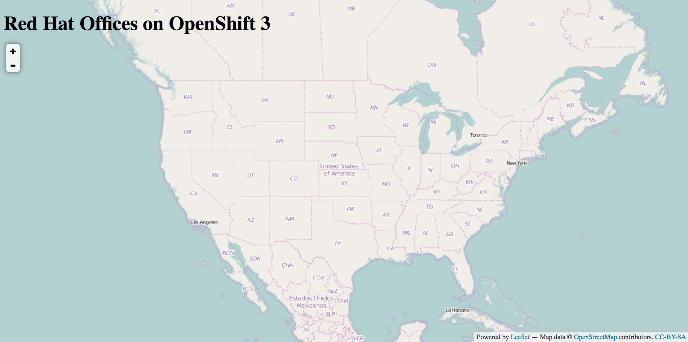

#**Lab 5: Deploying Java Code on JBoss**

###**Background: Source-to-Image (S2I)**

In lab two we learned how to deploy a standard Docker image. Now we will
expand on that a bit by learning how have OpenShift build a Docker image using
source code from an existing repository. To help with this, the OpenShift team
provides a set of Docker images that are enabled for a more generic build
mechanism, called Source-to-Image.

Source-to-Image (S2I) is another [open source
project](https://github.com/openshift/source-to-image) sponsored by Red Hat. Its
goal:

    Source-to-image (S2I) is a tool for building reproducible Docker images. S2I
    produces ready-to-run images by injecting source code into a Docker image and
    assembling a new Docker image which incorporates the builder image and built
    source. The result is then ready to use with docker run. S2I supports
    incremental builds which re-use previously downloaded dependencies, previously
    built artifacts, etc.

OpenShift is S2I enabled and can use S2I as one of its build mechanisms (in
addition to building Docker images from Dockerfiles, and "custom" builds). And,
OpenShift also will run the S2I process inside a special Pod, called a Build
Pod, which gives us the benefits of quotas, limits, resource scheduling, and
other aspects of OpenShift.

A full discussion of S2I is beyond the scope of this class.  However, if you
would like to learn more about this project, please read the
[documentation](https://github.com/openshift/source-to-image/blob/master/README.md
"documentation").  The only key concept you need to remember about S2I is that
it's magic. 

**Tip:** Red Hat provides a number of S2I-enabled runtimes with OpenShift, and
you can find more about them in [the
documentation](https://docs.openshift.com/enterprise/3.1/using_images/s2i_images/overview.html).

####**Exercise 4: Creating a JBoss EAP application**

The sample application that we will be deploying as part of this exercise is
called *ose-rht-offices*.  This application is a Java EE-based application that
performs 2D geo-spatial queries against a MongoDB database to locate and map all
Red Hat offices in North America. That was just a fancy way
of saying that we are going to deploy a map of Red Hat Offices.

#####**Create Project *

The first thing you need to do is create a new project called *CITYNAMEuserXX-rhtoffices*:

**Note:** Remember to replace CITYNAMEuserXX-rhtoffices with your correct user number.

    $ oc new-project CITYNAMEuserXX-rhtoffices

You should see the following output:

	Now using project "CITYNAMEuserXX-rhtoffices" on server "https://master.CITYNAME-roadshow.rhc-ose.labs.redhat.com:8443".

#####**Fork application code on GitHub**

OpenShift can work with git repositories on GitHub. You can even register
webhooks to initiate OpenShift builds triggered by any update to the application
code on GitHub. 

The repository that we are going to fork is located at the following URL:

[https://github.com/sabre1041/ose-rht-offices.git](https://github.com/sabre1041/ose-rht-offices.git")

Go ahead and fork the *ose-rht-offices* repository into your own GitHub account. Later
in the lab, we want you to make a code change and then rebuild your application.
If you are familiar with Java EE applications, you will notice that there is
nothing special about our application - it is a standard, plain-old JEE
application.

#####**Combine the code with the Docker image on OpenShift**

The *new-app* command makes it very easy to get OpenShift to build code from a
GitHub repository into a Docker image.  Now that you have your own GitHub
repository let's use it with OpenShift's JBoss EAP S2I image. 

Again, we use the new-app command just as we did with the *guestbook*
application in a previous lab. However, this time we are going to specify a
source code repository to use by using the ~ modifier as shown in the following
command:

	$ oc new-app jboss-eap64-openshift~https://github.com/sabre1041/ose-rht-offices.git

**Note:** Ensure that you use your repository URL if you want to see S2I in action later.

Once you enter in the above command, you should see output similar to the following:

    --> Found image cd9c119 (10 weeks old) in image stream "jboss-eap64-openshift in project openshift" under tag :latest for "jboss-eap64-openshift"
        * A source build using source code from https://github.com/sabre1041/ose-rht-offices.git will be created
        * The resulting image will be pushed to image stream "ose-rht-offices:latest"
        * This image will be deployed in deployment config "ose-rht-offices"
        * Ports 8080/tcp, 8443/tcp, 8778/tcp will be load balanced by service "ose-rht-offices"
    --> Creating resources with label app=ose-rht-offices ...
        ImageStream "ose-rht-offices" created
        BuildConfig "ose-rht-offices" created
        DeploymentConfig "ose-rht-offices" created
        Service "ose-rht-offices" created
    --> Success
        Build scheduled for "ose-rht-offices" - use the logs command to track its progress.
        Run 'oc status' to view your app.
.

Keep an eye on the Pods that are created as the build and deployment happens.
Remember, this is a new Java-based project that uses Maven as the build and
dependency system.  For this reason, the initial build will take a few minutes
as Maven downloads all of the dependencies needed for the application.

In a few moments, OpenShift will automatically start the first build for you.
You can see this in the web console:

    Build ose-rht-offices #1 is running. A new deployment will be created automatically once the build completes

You can also see this with the *oc* command:

    $ oc get builds

Once your first build is running, you'll see output like:

    NAME                TYPE      FROM          STATUS    STARTED         DURATION
    ose-rht-offices-1   Source    Git@0b16352   Running   2 minutes ago   2m54s

Once the build is running, you are able to view the build logs with the following
command:

	$ oc build-logs ose-rht-offices-1

After the build has completed and successfully:

* The S2I process will push the resulting Docker image to the internal OpenShift registry
* The DeploymentConfiguration (DC) will detect that the image has changed, and this
  will cause a new deployment to happen.
* A ReplicationController (RC) will be spawned for this new deployment. 
* The RC will detect no Pods are running and will cause one to be deployed, as
    our default replica count is just 1.

In the end, when issuing the *oc get pods* command, you will see that the build Pod
has finished (exited) and that an application Pod is in a ready and running state:

	ose-rht-offices-1-build   0/1       ExitCode:0   0          5m
	ose-rht-offices-2-ikb23   1/1       Running      0          59s

Once your application pod is in a ready and running state, the next thing we
need to do is create a route for the application based upon the service that was
created automatically.  Hopefully you remember how to do this from a previous
lab but, if you forgot, the command is:

	$ oc get services

Once you know the service name you want to expose:

	$ oc expose service ose-rht-offices

And finally, you can find your URL by viewing the project in the web console or by issuing the following command:

	$ oc get routes

Where you should see something like the following:

	NAME              HOST/PORT                                                                              PATH      SERVICE           LABELS                INSECURE POLICY   TLS TERMINATION
    ose-rht-offices   ose-rht-offices-oseuser-rhtoffices.apps.CITYNAME-roadshow.rhc-ose.labs.redhat.com             ose-rht-offices   app=ose-rht-offices      

In the above example, the URL is:

	ose-rht-offices.CITYNAMEuserXX-rhtoffices.apps.CITYNAME-roadshow.rhc-ose.labs.redhat.com

Verify your application is working by viewing the URL in a web browser.  You should see the following:

Wait a second!  Why are the offices not showing up?  Well, that is
because we haven't actually added a database to the application yet.  We will do
that in the next lab. Congratulations on deploying your first application
using S2I on the OpenShift 3 Platform!

**End of Lab 5**