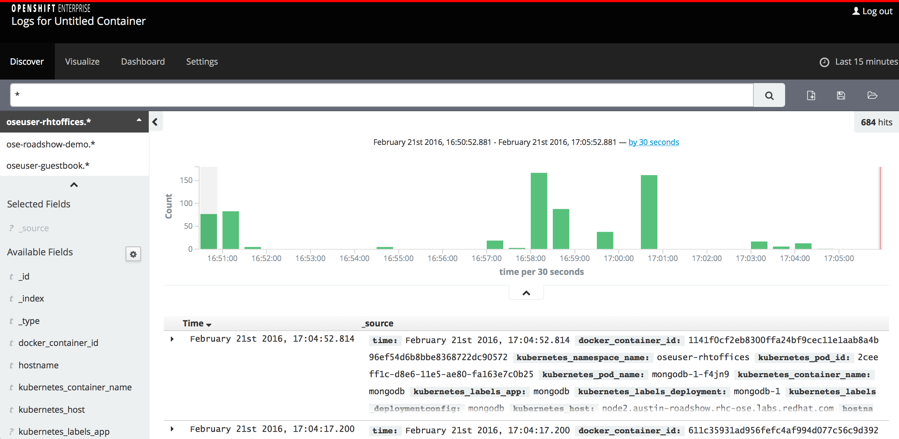
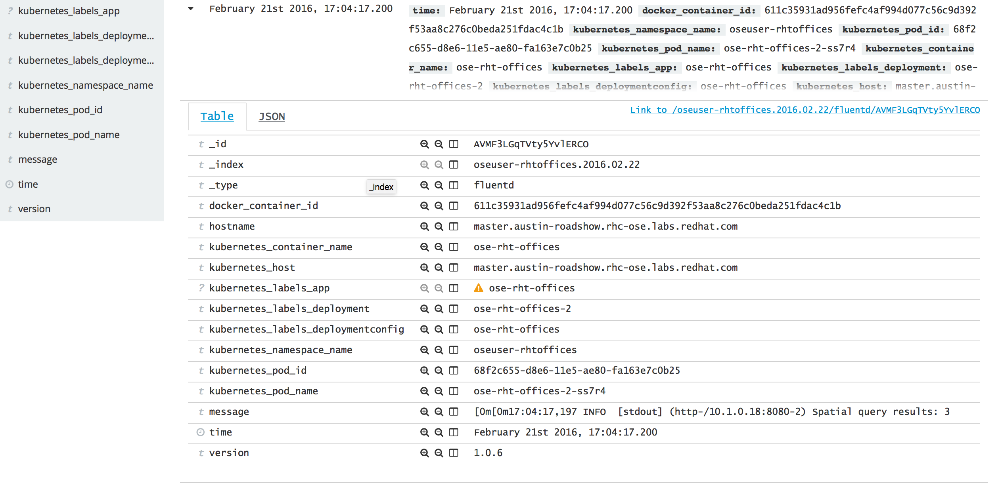
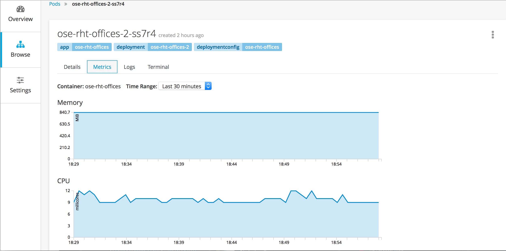

#**Lab 7: Log Aggregation and Metrics**

As we have seen so far, building, deploying and running containers in OpenShift can be completed with ease. However, once containers have been deployed, there is typically a desire to have insights into any running applications and the overall state of the containers. OpenShift provides built in functionality to provide telemetry information of running containers through log aggregation and metrics reporting. The information captured through these facilities also enables additional functionality within the platform such as autoscaling based on operational metrics. 

##**Container Log Aggregation using the EFK Stack**

OpenShift provides administrators and developers the functionality to aggregate both cluster statistics along with application logs to a centralized location using the EFK which is a slightly modified version of the [ELK stack](https://www.elastic.co/videos/introduction-to-the-elk-stack). 

The following components make up the EFK stack:

* [Elasticsearch](https://www.elastic.co/products/elasticsearch): an object store where all logs are stored.
* [Fluentd](http://www.fluentd.org/architecture): gathers logs from nodes and feeds them to Elasticsearch
* [Kibana](https://www.elastic.co/guide/en/kibana/current/introduction.html): a web UI for Elasticsearch

OpenShift administrators can deploy the entire logging stack during the installation of the platform which aggregates logs from all nodes and projects into Elasticsearch which can be displayed in Kibana. Users can access Kibana to view the logs for the projects they have the requisite permissions. The OpenShift documentation on [Aggregating Container Logs](https://docs.openshift.com/enterprise/3.1/install_config/aggregate_logging.html) contains the steps necessary to deploy and verify a running EFK stack within OpenShift. 

The EFK stack has been deployed into this OpenShift environment. The Kibana UI can be accessed by navigating to the following location:

    https://kibana.apps.CITYNAME-roadshow.rhc-ose.labs.redhat.com
    
The Kibana UI utilizes OAuth tokens from OpenShift so you can use the same credentials that were used for the OpenShift user interface.

Once authenticated, you will be presented with a console where you can view and search from the logs from the running containers that have been aggregated from the projects you have access to. The list of projects that are available to you can be viewed on the left side of the screen just below the search bar.

Locate the project called *CITYNAMEuserXX*. If you do not see it, select the down arrow to expand the list of available projects and then select it.

The console provides several methods for searching and visualizing the results. The textbook can be used to construct a search query to filter collected logs based on criteria. By default, messages for the last 15 minutes are displayed. To change this value, select the *Last 15 minutes* button to the upper right of the search bar. A set of options will be presented to you to allow customization of the search query interval.

Each query result that is returned can be expanded to view the entire result indexed by Elasticsearch by selecting the down arrow to the left of each result.

 

Additional fields can also be added to the search results by selecting from the list of available fields on the left side of the page. 

A full guide to the Kibana console can be found in the [official product documentation](https://www.elastic.co/guide/en/kibana/4.1/index.html)

##**Container Metrics**

To gain additional insight into the OpenShift cluster, the [Kubelet](https://docs.openshift.com/enterprise/3.1/architecture/infrastructure_components/kubernetes_infrastructure.html#kubelet) that runs on each node provides the functionality to expose metrics of the running containers and can be consumed by back end applications for analysis. OpenShift utilizes [Heapster](https://github.com/GoogleCloudPlatform/heapster) as the back end technology in conjunction with the [Hawkular Metrics](https://github.com/hawkular/hawkular-metrics) which stores the data in a Cassandra database. 

The process for collecting metrics data in OpenShift starts off by Heapster querying the OpenShift API for a list of running nodes. Based on the results, each node is contacted through an exposed rest endpoint to consume CPU usage and memory consumption which is then converted into Hawkular Metrics. Once cluster metrics has been enabled, the resources collected can be viewed in the OpenShift console in a graphical format. The process for setting up cluster metrics including an overview of the technologies involved can be found in the [product documentation](https://docs.openshift.com/enterprise/3.1/install_config/cluster_metrics.html).

The statistics of individual containers stored in Hawkular Metrics can be viewed in the OpenShift web console in the *Pods* section. Since we have several pods that are currently running, we can view their statistics. 

*Note: Since the OpenShift web console communicates with Hawkular Metrics via REST communication, it is important that any potential communication issue is resolved before attempting to view the metrics data. If the Hawkular Metrics rest endpoint is secured with a self signed certificate, an exception for the certificate must be added to the browser. Navigate to the following address and add an exception for the certificate:
*
    https://hawkular-metrics.apps.CITYNAME-roadshow.rhc-ose.labs.redhat.com/hawkular/metrics
    
Now, navigate to the OpenShift web console and select the *CITYNAMEuserXX* project then **Pods** after hovering the **Browse** tab on the lefthand side.

Select the **Metrics** tab which will populate graphs of the memory and CPU statistics of the container

You can also modify the *Time Range* to visualize the container load over a time series.

Additional metrics is expected to be exposed in upcoming versions of OpenShift.

**End of Lab 7**