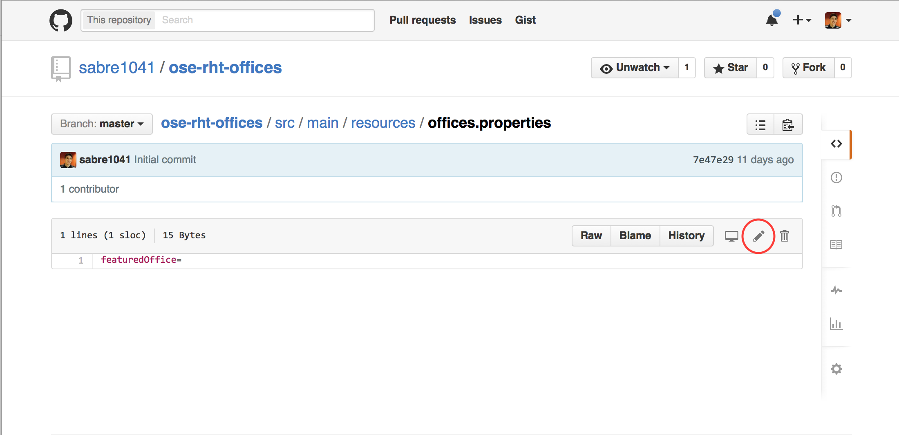
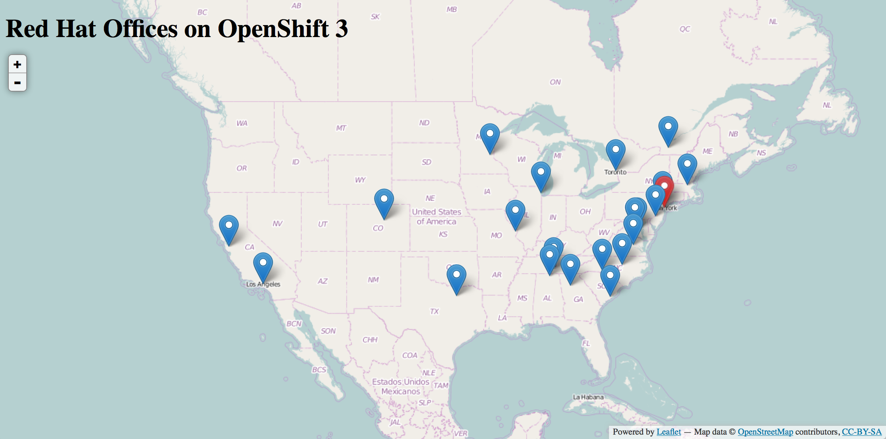

#** Lab 8: Making Code Changes**

One of the benefits of OpenShift 3 is the ability to make code changes and to see the results rapidly. The *ose-rht-offices* application allows for certain offices to be "featured"" by changing the marker color to red instead of blue. We will make a small code change in the forked project you configured during the last lab. 

Navigate to the code repository
that you forked on GitHub. Remember, it probably looks like:

    https://github.com/USERNAME/ose-rht-offices

The way to configure "featured" offices is to set a property called *featuredOffices* in the *src/main/resources/offices.properties* file. 

Navigate to the */src/main/resources* directory in your GitHub project and then
click on the *offices.properties* file.

Once you have the file on the screen, click the edit button in the top right
hand corner as shown here:

Set the value to the of this property to the *CITYNAME*. Multiple comma separated values are supported

**Note**: The list of offices that is populated into the database is driven from a *rhtoffices.json* files also located in the *src/main/resources* folder.

    { "name": "Chicago", "city": "Chicago", "code": "ord", "street": "101 N. Wacker Dr., Ste. 150", "state": "Illinois", "zip": "60606", "phone": "+1 312 660 3500", "fax": "+1 312 660 3558", "coordinates":[    -87.636392,    41.883589  ]},

The **code** value is the field that is evaluated for the featured office

Click on Commit changes at the bottom of the screen.

There are multiple ways to trigger builds in OpenShift including invoking a web hook and GitHub integration. Since the roadshow environment is located on a private network, GitHub invocations cannot be utilized. Full details on the the types of triggers that can be configured are found in the [Build Triggers](https://docs.openshift.com/enterprise/3.0/dev_guide/builds.html#build-triggers) section of the documentation

Once you have committed your changes, start a new build of the *ose-rht-offices* project by clicking the **Start Build** button on the *Builds* page in the web console, or run the
following command to verify:

	$ oc get builds

You should see that a new build is running:
	
    NAME                   TYPE      STATUS     POD
    ose-rht-offices-1   Source    Complete   openshift3mlbparks-1-build
    ose-rht-offices-2   Source    Running    openshift3mlbparks-2-build

Once the build and deploy has finished, verify your new Docker image was
automatically deployed by viewing the application in your browser:

**End of Lab 8**